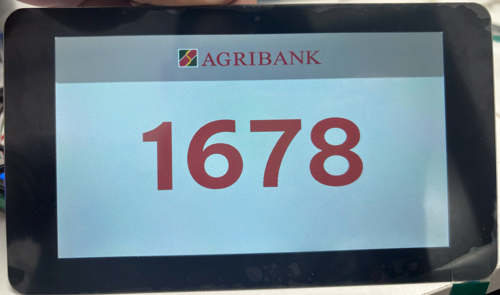
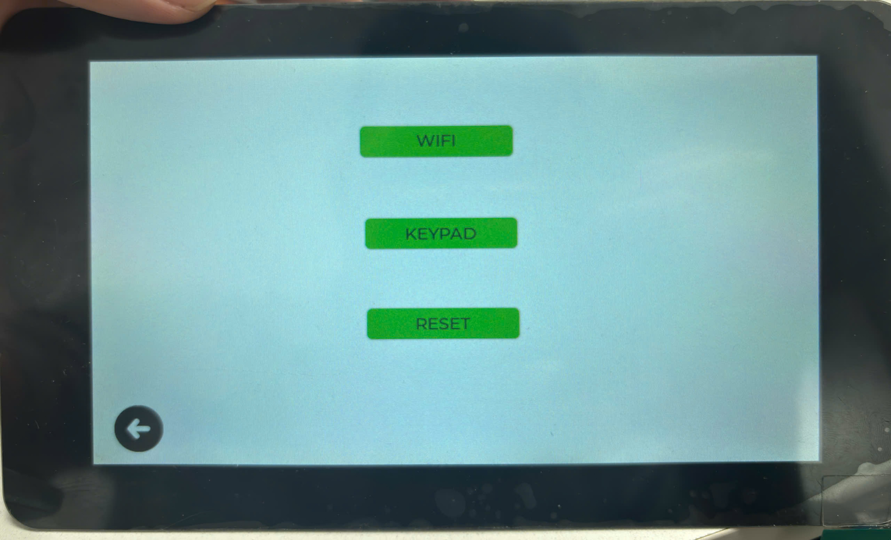
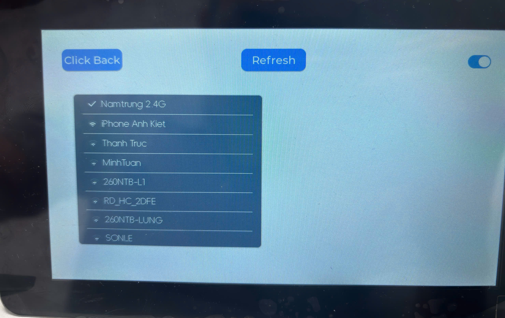
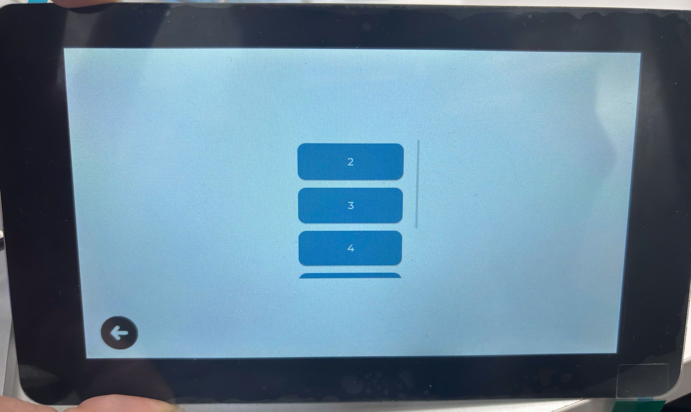

# QMS_DISPLAY NUMBER SCREEN

ESP32-S3 + 7 Inch LCD Touch Screen

Thiết bị màn hình hiển thị số thứ tự khách hàng sử dụng **ESP32-S3-Touch-LCD-7B**,  
ứng dụng cho ngân hàng, bệnh viện, trung tâm hành chính, quầy giao dịch.

Khách hàng có thể biết được số thứ tự được gọi đến quày giao dịch.

---

## Features

- Giao diện hiển thị số thứ tự khách hàng tại quầy trực quan trên LCD 7 inch
- Hỗ trợ cảm ứng
- Các chế độ hiển thị:
  - Hiển thị số thứ tự khách hàng
  - Hiển thị dòng chữ "QUẦY TẠM THỜI ĐÓNG"
  - Khi reset thì màn hình trống, không hiển thị
- Các giao diện của màn hình gồm có:
  - Giao diện hiển thị số đang gọi hoặc hiển thị dòng chữ báo đóng quầy (**Screen 1**)
  - Giao diện menu (**Screen 2**)
  - Giao diện chọn keypad để kết nối đến (**Screen 3**)
  - Giao diện đăng nhập wifi (**Wifi Screen**)

- Kết nối tới WiFi được nhập từ màn hình
- Wifi sau khi được kết nối thành công sẽ được lưu trong bộ nhớ NVS và tự động kết nối khi khởi động thiết bị
- Kết nối lại wifi 10 lần khi bị mất kết nối
- Hiển biểu tượng sóng wifi 5 mức độ trên giao diện đánh giá và đăng nhập để người dùng biết tình trạng kết nối wifi
- Kết nối đến server và đến bàn phím gọi số tại quầy thông qua MQTT
- Có thể lựa chọn bàn phím gọi số tại quầy mà người dùng muốn kết nối đến, kết quả sẽ được lưu trong bộ nhớ NVS cho các lần sử dụng tiếp theo
- Hiển thị số thứ tự khách hàng nhận được từ bàn phím gọi số
- Lưu lại số thứ tự khách hàng hiện tại trong bộ nhớ NVS và hiển thị lại số đó trong lần khởi động tiếp theo cho trường hợp có sự cố mất điện

---

## System Overview

- MCU: **ESP32-S3**
- Display: **LCD TFT 7 inch**
- Touch Panel: Capacitive
- Connectivity: WiFi, MQTT
- Storage: Flash nội ESP32

---

## Project Structure

```
project/
├── main/
│ ├── esp_mqtt_client/
| ├── init_handle/
│ └── user/
|      └──wifi
└── README.md
```

## System Workflow

### 1. Boot & reconnect

- Thiết bị khởi động.
- Hiển thị **Screen 1** (màn hình chính)
- Kiểm tra thông tin wifi trong bộ nhớ, nếu có lưu trước đó → Tự động kết nối đến wifi này
- Nếu kết nối wifi thành công thì kết nối đến server, nếu không thành công sẽ retry **5 lần**
- Trạng thái kết nối đến wifi được hiển thị thông qua icon cột sóng wifi ở góc phải trên cùng màn hình
- Nếu thiết bị kết nối đến server thất bại → Hiển thị icon mất kết nối tại góc phải dưới cùng màn hình
- Nếu thiết bị kết nối đến server thành công → Không hiển thị icon
- Chạm **3 lần liên tục góc trên cùng bên trái** → vào giao diện menu (**Screen 2**)

<div align="center">
  
  <br>
  <em>Màn hình chính</em>
</div>

### 2. Display

- Thiết bị nhận được số thứ tự khách hàng từ bàn phím gọi số → hiển thị màn hình số thứ tự
- Thiết bị nhận được lệnh reset từ bàn phím gọi số → màn hình hiển thị trống
- Khi chọn "RESET" tại màn hình menu thì màn hình hiển thị trống

---

### 3. Menu & Settings

- Ở màn hình chính:
  - Chạm **3 lần góc trên bên trái** → vào menu (**Screen 2**) để chọn chức năng
- Các chức năng:
  - **WIFI**:
    - Vào màn hình cấu hình wifi
  - **KEYPAD**:
    - Chọn bàn phím gọi số trong hệ thống
    - Thiết bị được chọn hiển thị số **màu đen**
  - **RESET**:
    - Xóa số hiển thị hiện tại trong bộ nhớ, màn hình hiển thị số lúc này sẽ trống

<div align="center">
  
  <br>
  <em>Màn hình menu</em>
</div>

---

### 4. WiFi Configuration

- Thưc hiện ở **Screen Wifi**
- Giao diện WiFi:
  - `Refresh`: quét lại danh sách WiFi
  - `Back`: quay lại màn hình trước
  - `Switch`: bật / tắt WiFi
- Khi khởi động:
  - Tự động kết nối WiFi đã lưu trong NVS

<div align="center">
  
  <br>
  <em>Màn hình cấu hình wifi</em>
</div>

---

### 5. Select keypad

- Thưc hiện ở **Screen 3**
- Thiết bị nhận được list các bàn phím gọi số trong hệ thống từ server thông qua MQTT
- List các thiết bị hiển thị trong Screen3
- Keypad được chọn sẽ có **tên được in đen** tại list button

<div align="center">
  
  <br>
  <em>Màn hình chọn bàn phím gọi số để kết nối</em>
</div>

---

| Supported Targets | ESP32-S3 |
| ----------------- | -------- |

| Supported LCD Controller | ST7262 |
| ------------------------ | ------ |

| Supported TOUCH Controller | GT911 |
| -------------------------- | ----- |

## How to use the example

## ESP-IDF Required

### Hardware Required

- An Waveshare ESP32-S3-Touch-LCD-4.3 development board

### Hardware Connection

The connection between ESP Board and the LCD is as follows:

```
       ESP Board                           RGB  Panel
+-----------------------+              +-------------------+
|                   GND +--------------+GND                |
|                       |              |                   |
|                   3V3 +--------------+VCC                |
|                       |              |                   |
|                   PCLK+--------------+PCLK               |
|                       |              |                   |
|             DATA[15:0]+--------------+DATA[15:0]         |
|                       |              |                   |
|                  HSYNC+--------------+HSYNC              |
|                       |              |                   |
|                  VSYNC+--------------+VSYNC              |
|                       |              |                   |
|                     DE+--------------+DE                 |
|                       |              |                   |
|               BK_LIGHT+--------------+BLK                |
       ESP Board                             TOUCH
+-----------------------+              +-------------------+
|                    GND+--------------+GND                |
|                       |              |                   |
|                    3V3+--------------+VCC                |
|                       |              |                   |
|                  GPIO8+--------------+SDA                |
|                       |              |                   |
|                  GPIO9+--------------+SCL                |
|                       |              |                   |
       ESP Board                                LED
+-----------------------+              +-------------------+
|                   GND +--------------+GND                |
|                       |              |                   |
|                   3V3 +--------------+VCC                |
|                       |              |                   |
|                    AD +--------------+LED                |
+-----------------------+              |                   |
|                       |              |                   |
       IO EXTENSION.EXIO1+--------------+TP_RST            |
|                       |              |                   |
       IO EXTENSION.EXIO2+--------------+DISP_EN           |
                                       +-------------------+
```

- Demonstrates an LVGL slider to control LED brightness.

### Configure the Project

### Build and Flash

Run `idf.py set-target esp32s3` to select the target chip.

Run `idf.py -p PORT build flash monitor` to build, flash and monitor the project. A fancy animation will show up on the LCD as expected.

The first time you run `idf.py` for the example will cost extra time.

(To exit the serial monitor, type `Ctrl-]`.)

See the [Getting Started Guide](https://docs.espressif.com/projects/esp-idf/en/latest/get-started/index.html) for full steps to configure and use ESP-IDF to build projects.

## Troubleshooting

For any technical queries, please open an https://service.waveshare.com/. We will get back to you soon.
